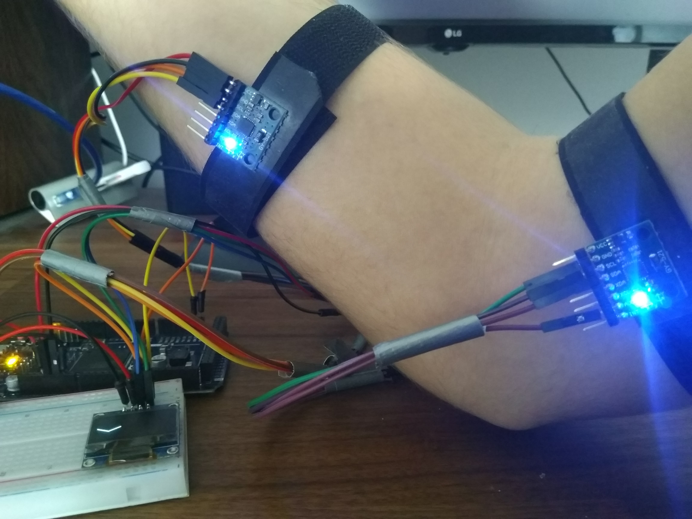
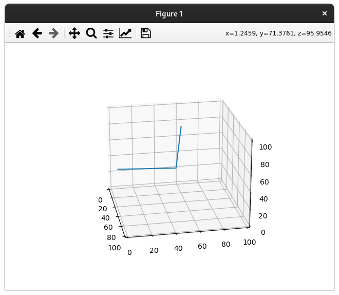

# MorphXR
MorphXR is een proof of concept voor een XR body tracking systeem. Dit is geschreven voor mijn school project van blok D leerjaar 1.

## Inhoudsopgave 
* [Algemene informatie](#algemene-informatie)
* [Technologieën](#technologieën)
* [Concept](#concept)
* [Conclusie](#conclusie)
* [Auteur](#auteur)
* [Licentie](#licentie)

## Algemene informatie
Dit project was een eindopdracht van blok D 2021 leerjaar 1.
Dit proof of concept zal aantonen of het haalbaar is om een body tracking solution te maken voor XR devices.
	
## Technologieën
Project is gemaakt met:
* C++
* GNU Make
* [ipass-mpu6050](https://github.com/Appenzeill/ipass-mpu6050)
* [hwlib](https://github.com/wovo/hwlib)
* [bmptk](https://github.com/wovo/bmptk)

## Concept
Het idee achter dit proof of concept is dat je doormiddel van acceleratie en gyroscoop data de houding van een arm kan bepalen zonder externe camera's of sensoren. Dit zou gebruikt kunnen worden in de XR als een manier van full body tracking voor inside out VR HMD's. (VR headsets waarvan de cameras op de headset zitten, en niet buiten de headset.

## Resultaten

## Conclusie
Het proof of concept toont aan dat het mogelijk is om een onderdeel van het lichaam, bijvoorbeeld een arm op een relatief nauwkeurige manier te tracken.
Echter zou voor een volledig lichaam de hoeveelheid sensoren aanzienlijk vergroten. Dit kan mogelijk complicaties veroorzaken. Op het moment werkt alleen verticaal, maar horizontaal zou mogelijk moeten zijn met wat meer onderzoek en werk.

Echter is het met deze methode wel mogelijk om zonder externe sensoren het lichaam te tracken, en is hiervoor een mogelijke oplossing voor headsets zonder een extern tracking systeem een full body tracking solution uit te brengen.
	
## Auteur 
* Daan Roth | 1782443 | [Appenzeill](https://github.com/Appenzeill)

## Licentie
Dit project heeft de GNU General Public Licentie v3 [GPLv3](https://www.gnu.org/licenses/gpl-3.0.en.html) of een latere versie naar keuze.
